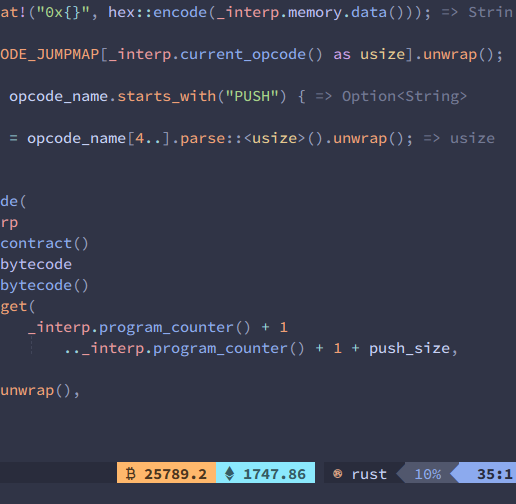

<h1 align="center">cryptoline.nvim</h1>
<p align="center">
🚀 Neovim plugin to show real time crypto price right into your lualine 🚀


</p>




<br/>


# Installation
## Packer
```
use 'daedlock/cryptoline.vim'
```

# Configuration
## Lualine

The plugin exposes `btc_price` and `eth_price` global functions. You can use them in your lualine configuration as the below example
```lua
local cryptoline = require "cryptoline"

require('lualine').setup({
    options = {
        -- theme = 'nord',
        theme = 'catppuccin',
        icons_enabled = true,
    },
    sections = {
        lualine_c = {
            'filename', 'lsp_progress'
        },
        lualine_x = {
            {
                crypto_ticker.btc_price,
                color = { bg = '#ffb86c', fg = '#4b361f', gui = 'bold' }
            },
            {
                crypto_ticker.eth_price,
                color = { bg = '#8be9fd', fg = '#365b63', gui = 'bold' }
            },
            {
                'filetype'
            }

        }
    }
})

```
